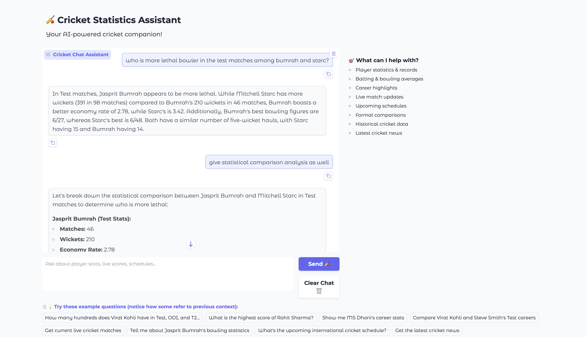

# Cricket MCP Server

A Model Context Protocol (MCP) server that provides comprehensive cricket data from Cricbuzz. This server offers real-time cricket statistics, player information, match schedules, and news updates.

## Features

- **Player Statistics**: Get detailed cricket player stats including batting and bowling records across all formats (Test, ODI, T20)
- **Live Matches**: Fetch currently ongoing cricket matches
- **Match Schedule**: Get upcoming cricket match schedules
- **Cricket News**: Latest cricket news and updates
- **ICC Rankings**: Official ICC rankings for batting, bowling, all-rounders, and teams across Test, ODI, and T20 formats
- **Match Scorecards**: Detailed match analysis with batting and bowling statistics
- **Live Commentary**: Recent ball-by-ball updates for a given match URL
- **Web Search**: Internet search with titles/snippets for cricket topics

## Installation

1. Clone or download this repository
2. Install the required dependencies:

```bash
pip install -r requirements.txt
```

## Demo: Gradio Web UI

You can interact with the Cricket MCP Server using a conversational web interface powered by Gradio and Gemini.

### 1. Set your Gemini API key

You need a Google Gemini API key to use the conversational agent. Set it as an environment variable:

```bash
export GOOGLE_API_KEY="your-gemini-api-key"
```

### 2. Run the Gradio demo

```bash
python3 cricket_gradio.py
```

This will launch a web UI in your browser where you can chat with the cricket assistant, ask for stats, live matches, news, and more.

> **Tip:** The chat UI supports conversation memory and rich responses.



## Usage

### Running as an MCP Server

The server can be integrated with MCP clients. Here's how to configure it:

```python

    {
        "cricket": {
            "command": "python3",
            "args": ["cricket_server.py"],
            "transport": "stdio",
        }
    }
```

For a more flexible setup, you can use environment variables to define the python executable and server script path.

### Running Standalone

For testing purposes, you can run the server directly:

```bash
python3 cricket_server.py
```

## Available Tools

### 1. get_player_stats
Get comprehensive cricket player statistics.

**Parameters:**
- `player_name` (str): Name of the cricket player
- `match_format` (str, optional): Specific format ("Test", "ODI", "T20"). If not provided, returns all formats.

**Returns:**
- Player basic info (name, country, role, image)
- ICC rankings for batting and bowling
- Detailed batting statistics
- Detailed bowling statistics

**Example:**
```python
# Get all stats for a player
stats = get_player_stats("Virat Kohli")

# Get only T20 stats
t20_stats = get_player_stats("Virat Kohli", "T20")
```

### 2. get_live_matches
Get currently live cricket matches.

**Returns:**
List of live match information including teams and current status.

### 3. get_cricket_schedule
Get upcoming cricket match schedule.

**Returns:**
List of upcoming international cricket matches with dates and details.

### 4. get_cricket_news
Get the latest cricket news.

**Returns:**
List of cricket news articles with headlines, descriptions, timestamps, and categories.

### 5. get_icc_rankings
Get official ICC cricket rankings for various categories.

**Parameters:**
- `category` (str): The ranking category. Must be one of: "batting", "bowling", "all-rounder", or "teams".

**Returns:**
Dictionary with rankings for Test, ODI, and T20 formats. Each format contains a list of players or teams with their position, name, country, and rating.

**Example:**
```python
# Get batting rankings
batting_rankings = get_icc_rankings("batting")

# Get bowling rankings
bowling_rankings = get_icc_rankings("bowling")

# Get team rankings
team_rankings = get_icc_rankings("teams")
```

### 6. get_match_details
Get detailed scorecard for a specific cricket match.

**Parameters:**
- `match_url` (str): The URL of the match on Cricbuzz (can be obtained from get_live_matches).

**Returns:**
Dictionary containing match details including match title, result, and detailed scorecard for each innings with batting and bowling statistics.

### 7. get_live_commentary
Get recent live commentary for a specific cricket match.

**Parameters:**
- `match_url` (str): Cricbuzz match page URL (general match or direct commentary tab)
- `limit` (int, optional): Max number of recent items to return (default 20)

**Returns:**
Dictionary containing `title`, `commentary_url`, and `events` (list of commentary lines).

**Example:**
```python
commentary = get_live_commentary("https://www.cricbuzz.com/live-cricket-scorecard/12345")
```

### 8. web_search
Search the web and return results with titles and snippets.

**Parameters:**
- `query` (str): Search query
- `num_results` (int, optional): Number of results (default 5)
- `site_filter` (str, optional): Restrict to a domain like `cricbuzz.com`

**Returns:**
List of results: `{ "title": str, "url": str, "snippet": str }`.

### 9. search_live_commentary
Search for live commentary and updates for cricket matches on the web.

**Parameters:**
- `match_description` (str, optional): Full match description (e.g., "Zimbabwe vs New Zealand 2nd Test")
- `team1` (str, optional): First team name
- `team2` (str, optional): Second team name

**Returns:**
List of web search results for live commentary and match updates from cricket news sites.

**Example:**
```python
# Search by match description
results = search_live_commentary(match_description="Zimbabwe vs New Zealand 2nd Test")

# Search by team names
results = search_live_commentary(team1="Zimbabwe", team2="New Zealand")
```

## Data Source

This server scrapes data from Cricbuzz.com and uses Google Search for player profile discovery. Please ensure you comply with the website's terms of service and use responsibly.

## Dependencies

- `fastmcp`: MCP server framework
- `requests`: HTTP library for web scraping
- `beautifulsoup4`: HTML parsing library
- `lxml`: XML/HTML parser
- `googlesearch-python`: Google search API wrapper

## Configuration

The server runs on stdio transport by default. No additional configuration is required for basic usage.

## Error Handling

The server includes comprehensive error handling for:
- Network connectivity issues
- Invalid player names
- Missing data on Cricbuzz
- Search failures

## MCP Directory Badge

Add this badge to your README to show your server is listed and safe:

<a href="https://glama.ai/mcp/servers/@tarun7r/cricket-mcp-server">
  
</a>

## License

This project is licensed under the MIT License. See the [LICENSE](LICENSE) file for details.

## Contributing

Feel free to submit issues and enhancement requests!

## Disclaimer

This tool scrapes data from public websites. The authors are not responsible for any misuse or violation of website terms of service. Use responsibly and ensure compliance with applicable terms and conditions.
